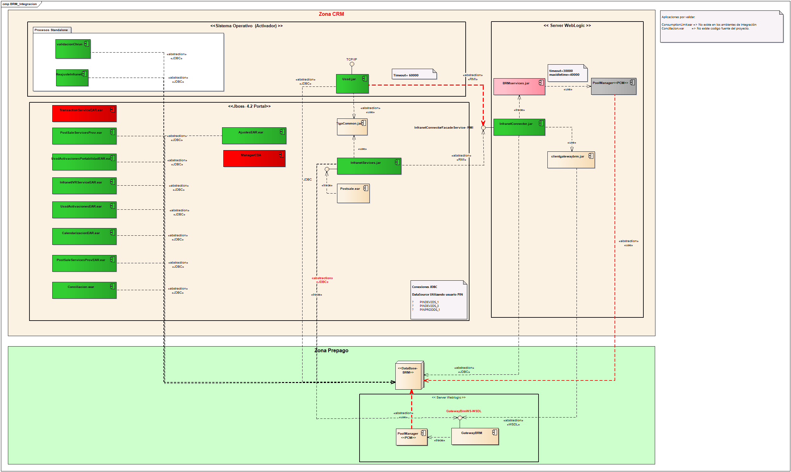

# Transferencia de conocimiento aplicaciones.

## ActivacionesCRM.  

El FRONT del activador se encuentra dentro del CRM portal (sostenibilidad) de Tigo. El Portal CRM es la plataforma CORE de la Unidad Móvil para el soporte a los procesos de venta, posventa y en general todos los procesos de servicio al cliente a usuarios de líneas móviles Tigo.
En Tigo contamos con diferentes familias o tipos de planes, que pueden ser activados de acuerdo con las necesidades de los clientes, estos se pueden clasificar:  
Activaciones:  
    • Prepago  
    • Control  
    • Arma Tu Plan (ATP)  
    • Postpago  
    • Financiación con Terceros (Credivalores)  
    • Portabilidad  
    • Ventas Segmentadas  
    

### Diferencias entre archivos EAR y WAR
La mayor diferencia entre los archivos JAR, WAR y EAR es el hecho de que están dirigidos a diferentes entornos. 
Un archivo EAR requiere un servidor de aplicaciones totalmente compatible con la plataforma Java, Enterprise Edition (Java EE) o Jakarta Enterprise Edition (EE), 
como WebSphere o JBoss, para ejecutarse. Un archivo WAR solo requiere un servidor de aplicaciones compatible con Java EE Web Profile para ejecutarse, y un archivo JAR
solo requiere una instalación Java.

Gestión de configuración.

URL Línea Base 
        
     http://10.100.82.12/Accenture-T2/CRM-Portal/APP-ActivadoresStandalone

Versionamiento GIT:

    http://netvm-pgit01

Merge:

Se pueden presentar dos escenarios para la realización del Merge.  
**Merge de la línea base:**  
cuando se pasa un requerimiento a producción rama X, desde la línea base se hace Merge con la rama X  
**Merge de una rama:**  
cuando hay un requerimiento en ejecución rama X (línea base + requerimiento), y en el periodo de ejecución pasa producción otro requerimiento con rama Z.
En este caso se crea una rama J la cual contiene la línea base(línea base + rama Z) y se hace un Merge con la rama X.

### Actualización de Línea Base  
Se realiza una semana después que se hace un paso a producción y con estabilización de los sistemas.

Procesos de Release o Versionamiento para Salidas (Dsllo, Integración o Pro)

    1. Salida a desarrollo: Se crea una rama reléase la cual va a
    contener el requerimiento + lo que está en la línea base. Se
    crea una carpeta con el nombre del requerimiento la cual va a
    contener la rama reléase.
    2. Salida a pruebas: Se copia la carpeta de desarrollo a pruebas.
    3. Salida a producción: Se copia la carpeta de pruebas a
    producción. Se hace un merge de la línea base con la rama
    reléase.

# activatorPort.jar

La aplicación de activatorPort soporta los procesos de portabilidad prepago y pospago, los cuales pueden ser realizados desde sistemas WEB (Portal CRM).

Para una activación Portabilidad prepago o Postpago, el proceso es similar al anterior con la diferencia de que se valida el NIP (número de identificación de portabilidad) y el activador Standalone que procesa la activación es activatorPort, además al finalizar la activación si esta es exitosa se genera una solicitud de portabilidad. A continuación diagrama de proceso de activación de portabilidad:

## Diagrama de componentes de la aplicación

## URL Línea Base

    http://10.100.82.12/Accenture-T2/CRM-Portal/APP-ActivadoresStandalone

El componente activatorPort.jar de los ActivadoresStandalone se encuentra desarrollado en JAVA, que compila bajo la versión jdk1.6.0_45.    

Se despliega en un SO Linux Red Hat Enterprise Linux Server release 6.6 configurado con un jboss-portal-2.7.1 Base de datos Oracle 10G y 11G. 

Ruta instalación activatorPort.jar: /home/app/portActivator/src   

# CRM - BRM

Los componentes que interfieren en el proceso de comunicación bajo el framework o utilidad Tigo Commons se explican a continuación:  

InfranetConnectorClient: Componente que contiene las interfaces remotos y utilidades comunes para realizar un llamado correcto a través de Infranet.   
Tigo-commons.xml: Archivo de configuración que soporta la ejecución de Tigo-Commons, en este se encuentra configurados entre algunas otras propiedades:  
Entorno: Determina el entorno en el cual se esta ejecutado.  
Nombre de la instancia del contenedor: Nombre del contenedor local  
Conexión a base de datos: Se especifica el nombre del Pool configurado o los datos de conexión en caso de ser una aplicación standalone como el activador.  
Propiedades: Siempre se especifican al menos dos, la de consulta de propiedades y las de inserción. Estas se encargar de obtener la configuración de la tabla TLC_CONFIG_PROPERTIES de PostSale.  

Tigo-commons: Componente que se encarga, entre algunas funciones de:  
Realizar la publicación en el árbol JNDI local del contenedor el mapeo a un EJB remoto que se encuentra en un contendor diferente bajo una JVM externa. Es acá donde se realiza el mapeo entre:   

Dentro del montaje de una aplicación y/o entorno que utilice de Tigo Commons para su funcionamiento es importante tener en cuenta los siguientes puntos:

- Todos los tigo-commons deben apuntar a la misma base de datos de PostSale (Activador, Jboss Portal, WebLogic)  
- El nombre del datasource especificado en tigo-commons debe estar configurado y apuntando al mismo postsale que los demás  
- Los archivos que referencias al home del dominio de weblogic que se esta montando deben estar correctamente configurados, algunos son:  

        WL_HOME/domain/config/config.xml
        WL_HOME/domain/init-info/startscript.xml
        WL_HOME/domain/bin/setDomainEnv.sh
        
para que funcione correctamente log4j se sugiere adicionar definir y exportar la ruta de log4j, esto garantiza la escritura de los logs de Tigo Commons y de InfranetConnector en Weblogic, esto se puede hacer en setDomainEnv.sh.

Tener en cuenta que NO todos las clases que se tienen en InfranetService utilizan InfranetConnector, por lo cual, durante pruebas ser cauteloso que se prueba y como.

## Billing and Revenue Management (BRM) system  

The url of the WSDL in integration environment is:  

    http://10.25.65.17:7001/gatewaybrmint/GatewayBrmWSInt?WSDL

The user is testuser and the password is testuser.  

