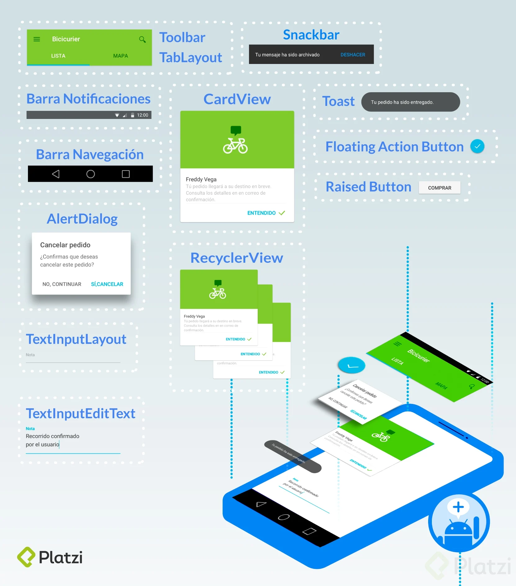
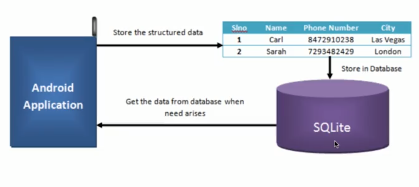
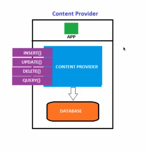
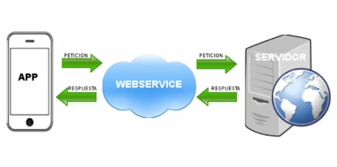

# Notas de Bases Técnicas de Andorid 

## Clase 13 . Qué es y como funciona Gradle.
Grade es un sistema integrado a Andorid y desarrollado por google que permite integrar dependencias, crear un sistema de archivos y generar un ejecutable  APK
Gradle es un sistema de compilación que reune en un uno solo las mejores prestaciones de otros sistemas de compilación. Está basado en JVM (Java Virtual Machine), lo que          significa que puedes escribir tu propio script en java, y que Android Studio lo entenderá y lo usará.

## Clase 14 Generación de un apk en Android.

APK es la extensión de los archivos ejecutables en Android su significado es application package, generarlo tiene un proceso interesante y se lleva a cabo bajo un proceso de compilación.

  1. El compilador de Android convierte tu código fuente a un tipo de bytecode pero más eficiente para la máquina virtual de Android estos son archivos .dex.

  2. Gradle empaqueta los archivos .dex y todos los recursos que usaste en la aplicación, imágenes, audios, videos, etc. generando un .apk
  3. Gradle firma tu apk resultante usando una keystore.
  4. Se puede generar un apk a modo de solo pruebas o general un apk listo para ser lanzado a la tienda, para cada caso será el tipo de keystore que debas usar.
  5. Como detalle notarás que al ejecutar el empaquetado intervendrá zipalign quien generará una versión optimizada del .apk para el teléfono

## Clase 15 Google Play Services.

Cuando queremos trabajar una aplicacion o integrar servicios de google debemos trabajar con estas librerias. por ejemplo login con google. 

  1. Instalar el .apk de Google Play Services.
  2. Incluir la librería del servicio que vayas a usar.

## Clase 16 Google Play Services.

 servicios de Google que tienes disponible para integrar a tus proyectos Android como librerías:
 API	BIBLIOTECA.
 
    Google+:	com.google.android.gms:play-services-plus:15.0.0
    Google Account Login:	com.google.android.gms:play-services-auth:15.0.0
    Google Actions, Base Client Library:**	com.google.and roid.gms: play-services-base:15.0.0    
    Google Sign In:	com.google.android.gms:play-services-identity:15.0.0    
    Google Analytics:	com.google.android.gms:play-services-analytics:15.0.0    
    Google Awareness:	com.google.android.gms:play-services-awareness:15.0.0
    Google Cast:	com.google.android.gms:play-services-cast:15.0.0  
    Google Cloud Messaging:**	com.google.android.gms:play-services-gcm:15.0.0  
    Google Drive:	com.google.android.gms:play-services-drive:15.0.0  
    Google Fit:	com.google.android.gms:play-services-fitness:15.0.0  
    Google Location and Activity Recognition:**	com.google.android.gms:play-services-location:15.0.0  
    Google Maps:	com.google.android.gms:play-services-maps:15.0.0  
    Google Mobile Ads:	com.google.android.gms:play-services-ads:15.0.0  
    Google Places:	com.google.android.gms:play-services-places:15.0.0  
    Mobile Vision:	com.google.android.gms:play-services-vision:15.0.0  
    Google Nearby:	com.google.android.gms:play-services-nearby:15.0.0  
    Google Panorama Viewer:	com.google.android.gms:play-services-panorama:15.0.0  
    Google Play Game Services:	com.google.android.gms:play-services-games:15.0.0  
    SafetyNet:	com.google.android.gms:play-services-safetynet :15.0.0  
    Android Pay:	com.google.android.gms:play-services-wallet :15.0.0  
    Wear OS by Google:	com.google.android.gms:play-services-wearable:15 .0.0  
    
    https://developers.google.com/android/guides/setup
    
    
## 17. Lenguajes para programar en Android.

  1. JAVA Y XML
  2. KOTLIN tambien necesita xml par ala parte gráfica: Adoptado por Google es el oficial Java tiene muchos problemas porque se escribe mas codigo y es un lengiaje muy facil.
  3. Opciones Híbridas Javascript ReatNative no ahorramos el codigo XML, usariamos html css y js para el front. 
  4. Ionic - Enteramente html ccs y js es una composicion hibrida, seria un web view ajustado a una aplicacion nativa, una pagina web dentro de un web view.
  5. Xamarin Forms, Es un stak constituido en C# es mi Microsoft y permite generar apps en apps para mac.

## 18. Qué es Material Design

Material Design son las métricas de diseño de aplicaciones fueron construidas por Google y traídas a Android a partir de la versión 5.0 Lollipop.
Específicamente lo que se introdujo es un tema nuevo, nuevos widgets y nuevas API’s de desarrollo.
Un tema nuevo que ofrece dos versiones obscuro y claro, que es dependiendo del tema que le quieras dar a tu proyecto.

Material Design está basado en el manejo real y físico de materiales, como son especialmente hojas de papel, además que este, permite jugar con las sombras para crear efectos tridimensionales, la integración de animaciones es tan realista que se comportarán de acuerdo a las leyes de la física, por lo tanto para general esto último tenemos API’s de desarrollo que se integraron para trabajar con efectos y animaciones que hagan más interactivo el diseño.

Si quieres conocer más sobre Material Design puedes ir al sitio oficial https://material.io/

Otro sitio muy interesante es https://dribbble.com/ el cual es muy conocido por ser la red social de diseñadores ahí encontrarás un gran catálogo de diseños de interfaces, ejecuta un par de búsquedas y muéstranos con un screenshot la que crees que más se apega a las métricas de Material Design.

## 19. Widgets de interfaz gráfica.

## 20. Flutter la nueva forma de hacer interfaces en Android y iOS.

https://flutter.dev/

Flutter es el nuevo SDK de Google creado para diseñar interfaces nativas iOS y Android. Utiliza el lenguaje de programación Dart y fue creado para programadores de interfaces móviles. Esto es el comienzo de lo porvenir en lo que será el frontend mobile.

## 21. Consideraciones para trabajar con Hardware en Android

Podemos acceder a todo el hardware del los dispositivos

SDK es el acrónimo de “Software Development Kit” (Kit de desarrollo de software). El SDK reúne un grupo de herramientas que permiten la programación de aplicaciones móviles.

Este conjunto de herramientas se puede dividir en 3 categorías:
SDK para entornos de programación o sistemas operativos (iOS, Android, etc.)
SDK para el mantenimiento de aplicaciones
SDK de marketing y publicidad

## 22. Niveles de Almacenamiento y tipos.

Alamacenamiento, simpre es inherente a persistir la información

Tipos de Almacenamiento.

**Almacenamiento Interno:** Memoria interna
**Almacenamiento Externo:** Memorias SD Card

##Formas de Persistir la informacion.

 1. Archivos que existen en el dispositivo Clase **File** puede vivir en la memoria interna o externa.
 2. **SharedPreferences** Archivo xml que vive en donde se encuentra la app movil, es devir vivie en el APK de la app. el apk es un tipo de compresion para la interpretacion de andriod. Dato Clave valor
 3. **Bases de Datos**. Relaciones entre datos vivien dentro del APK en el celular o en el FILE por ejemplo Whats APP
 4. Web Service, el nivel de persistencia trasciende, se envía a bases de datos en la nube, este tipo de almacenamiento requiere una conexión a internet.

##23. File y SharedPreferences.
**File**

    private File getTempFile(Context context, String url) {
    File file;
    try {
      String fileName = Uri.parse(url).getLastPathSegment();
      file = File.createTempFile(fileName, null, context.getCacheDir());
    } catch(IOException e) {}
    return file;
    }
Se trabaja con la clase file en Java/kotlin. Modo Nativo    Este es el permiso para leer y escribir memoria SD

    <manifest ...>
      <uses-permission android:name="android.permission.WRITE_EXTERNAL_STORAGE" />
      <uses-permission android:name="android.permission.READ_EXTERNAL_STORAGE" />
      ...
    </manifest>

**SharedPreferences**
  Utiliza una estructura .XML en forma de pares KEY:VALUE.
  El archivo se guarda en la carpeta shared_pref, dentro de la .apk.
  Se usan mucho para registrar preferencias de los usuarios como los colores, temas, scores, etc.
  Como definirlas:
  
    SharedPreferences pref = getSharedPreferences("MisPreferencias",Context.MODE_PRIVATE);

    SharedPreferences.Editor editor = pref.edit();
    editor.putString("email","cajotafer@gmail.com");
    editor.pitString("nombre", "Carlos");
    editor.commit();
 
 El archivo XML vivira dentro de la aplicación.
 
### 23. Content Providers Bases de Datos y Network.
 
Para trabajar con datos estructurados, complejos y relacionales. Se almacenan dentro del dispositivo, pero se puede almacenar externamente. Aunque, puede que la información se vea vulnerable. Por lo que, los datos se deben encriptar para proteger la información.

**SQLite:** es un motor de base de datos que emplea Android. En la cual, las aplicaciones pueden guardar su información con las preferencias de los usuarios con data más extensa, a comparación de Shared Preferences.
Los datos viven, mientras la aplicación viva. En caso, se desinstale la app, lo datos se perderán.

**Content Provider (Proveedor de Contenido):** Permite acceder a las bases de datos de otras aplicaciones que estén proveendo contenido. Ej. Consumir datos de los contactos del teléfono. las bases de datos vivien dentro de android.
No requieren de conexión a internet. ejemplo aplicaciones de contactos.

**Web Service:** Los datos se pueden almacenar también en una base de datos que se encuentra en alguna parte de internet. Antes, es necesario identificar si el dispositivo puede acceder a internet. Además, podemos crear validaciones para limitar la cantidad de datos a consumir. Permite, trabajar con aplicaciones off-line.

Los servidores deben estar siempre online para que los datos estén disponibles. Para ello, se puede usar plataformas Cloud. Por ej. Azure, Amazon Web Service, Firebase, etc.

###25 Tipos de Testing en Android y UI Test

Llevar un proceso de Testing en nuestras aplicaciones debe ser un proceso rigurosamente obligatorio, testear tus aplicaciones hará tus usuarios reciban mayor calidad en el producto que les estás proporcionando.
Existen algunos tipos de pruebas que podemos ir ejecutando progresivamente a nuestras apps.

Pruebas de unidad local
Pruebas instrumentadas
Pruebas de interfaz de usuario
Éstas se pueden ver ubicadas en la siguiente pirámide desde la base hasta la punta:

**Las pruebas de unidad local** son test pequeños que a medida que vas generando código lo vas probando rápidamente en tu computadora. También puedes programar código automatizado que ejecute una prueba.

**Las pruebas de instrumentación** principalmente las deberás ejecutar en el dispositivo y son básicamente pruebas donde integras los test anteriores a fin de que módulo a módulo la aplicación se vaya comportando adecuadamente, aquí testeamos que los módulos, servicios, etc. funcionen en conjunto.

**Las pruebas de interfaz de usuario** son totalmente enfocadas en el flujo de la interfaz de usuario, con esto nos aseguramos que las tareas que debe realizar el usuario en la aplicación funcionen como se espera.

Android Studio te ayudará a llevar los procesos de Testing que requieren tus apps, posee herramientas que nos ayudan a lograr esto. Investiga productos, frameworks, etc. que te ayudan a ejecutar cualquiera de los tipos de pruebas que vimos hace un momento, compartelos en la sección de comentarios.

## 26 Tienda de Aplicaciones Android

Google Play Store es la tienda oficial de aplicaciones android, en ella encontrarás todo el catálogo de aplicaciones que puedes instalar en tu dispositivo.

Como desarrollador móvil te interesará entrar y dejar disponibles tus aplicaciones para que todo el mundo pueda conocer tu trabajo. El único requisito para lograr esto es obtener una cuenta de desarrollador de Google Play. Para ello deberás:

  1. Registrarte en este enlace https://play.google.com/apps/publish/signup/
  2. Aceptar el acuerdo de distribución para desarrolladores, lo puedes consultar aquí: https://play.google.com/about/developer-distribution-agreement.html
  3. Pagar la única tarifa de registro de $25 USD al día de hoy.
  4. Completar los datos de la cuenta.

Una vez hecho esto te dará acceso al Google Play Console (https://play.google.com/apps/publish/?account=7750131643547052717#AppListPlace) y estarás listo para publicar tus aplicaciones.

En la Google Play Console podrás administrar todas las fases de publicación de tu app, además de probar y recopilar datos antes de lanzar o incluso una vez que ya lo hiciste, puedes asignar precios y manejar informes de ventas, ver y administrar comentarios de tus usuarios, tener estadísticos y datos para entender y mejorar la estabilidad de tu producto. Todo esto ofrece la consola de Google Play entre muchas otras cosas más.
