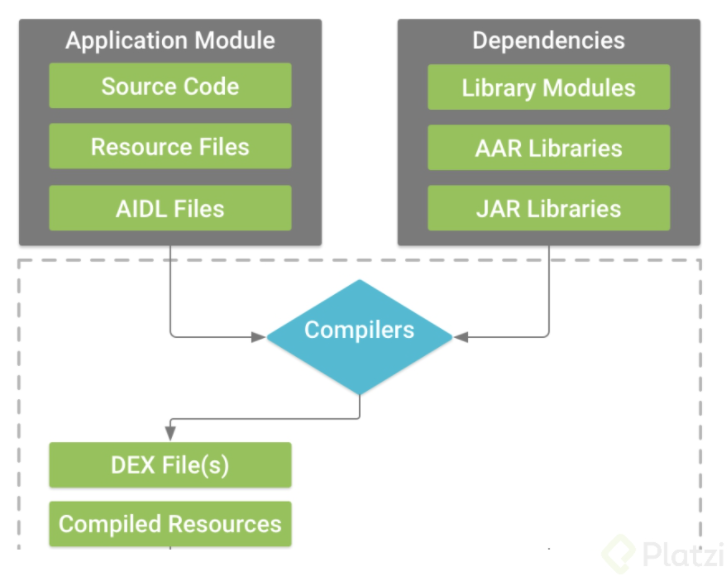
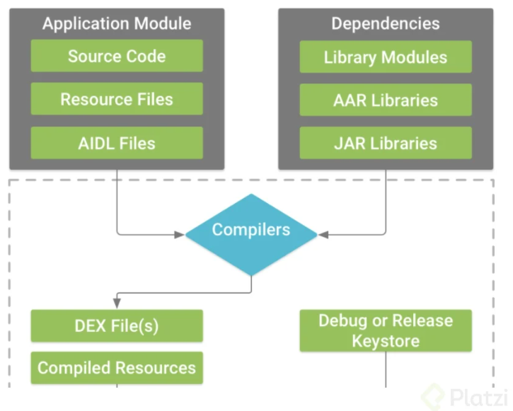
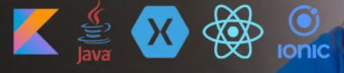

# Notas de Bases Técnicas de Andorid 

## Clase 13 . Qué es y como funciona Gradle.
Grade es un sistema integrado a Andorid y desarrollado por google que permite integrar dependencias, crear un sistema de archivos y generar un ejecutable  APK
Gradle es un sistema de compilación que reune en un uno solo las mejores prestaciones de otros sistemas de compilación. Está basado en JVM (Java Virtual Machine), lo que          significa que puedes escribir tu propio script en java, y que Android Studio lo entenderá y lo usará.

### Clase 14 Generación de un apk en Android.

APK es la extensión de los archivos ejecutables en Android su significado es application package, generarlo tiene un proceso interesante y se lleva a cabo bajo un proceso de compilación.

  1. El compilador de Android convierte tu código fuente a un tipo de bytecode pero más eficiente para la máquina virtual de Android estos son archivos .dex.

  2. Gradle empaqueta los archivos .dex y todos los recursos que usaste en la aplicación, imágenes, audios, videos, etc. generando un .apk
  3. Gradle firma tu apk resultante usando una keystore.
  4. Se puede generar un apk a modo de solo pruebas o general un apk listo para ser lanzado a la tienda, para cada caso será el tipo de keystore que debas usar.
  5. Como detalle notarás que al ejecutar el empaquetado intervendrá zipalign quien generará una versión optimizada del .apk para el teléfono

### Clase 15 Google Play Services.

Cuando queremos trabajar una aplicacion o integrar servicios de google debemos trabajar con estas librerias. por ejemplo login con google. 

  1. Instalar el .apk de Google Play Services.
  2. Incluir la librería del servicio que vayas a usar.

### Clase 16 Google Play Services.

 servicios de Google que tienes disponible para integrar a tus proyectos Android como librerías:
 API	BIBLIOTECA.
 
    Google+:	com.google.android.gms:play-services-plus:15.0.0
    Google Account Login:	com.google.android.gms:play-services-auth:15.0.0
    Google Actions, Base Client Library:**	com.google.and roid.gms: play-services-base:15.0.0    
    Google Sign In:	com.google.android.gms:play-services-identity:15.0.0    
    Google Analytics:	com.google.android.gms:play-services-analytics:15.0.0    
    Google Awareness:	com.google.android.gms:play-services-awareness:15.0.0
    Google Cast:	com.google.android.gms:play-services-cast:15.0.0  
    Google Cloud Messaging:**	com.google.android.gms:play-services-gcm:15.0.0  
    Google Drive:	com.google.android.gms:play-services-drive:15.0.0  
    Google Fit:	com.google.android.gms:play-services-fitness:15.0.0  
    Google Location and Activity Recognition:**	com.google.android.gms:play-services-location:15.0.0  
    Google Maps:	com.google.android.gms:play-services-maps:15.0.0  
    Google Mobile Ads:	com.google.android.gms:play-services-ads:15.0.0  
    Google Places:	com.google.android.gms:play-services-places:15.0.0  
    Mobile Vision:	com.google.android.gms:play-services-vision:15.0.0  
    Google Nearby:	com.google.android.gms:play-services-nearby:15.0.0  
    Google Panorama Viewer:	com.google.android.gms:play-services-panorama:15.0.0  
    Google Play Game Services:	com.google.android.gms:play-services-games:15.0.0  
    SafetyNet:	com.google.android.gms:play-services-safetynet :15.0.0  
    Android Pay:	com.google.android.gms:play-services-wallet :15.0.0  
    Wear OS by Google:	com.google.android.gms:play-services-wearable:15 .0.0  
    
    https://developers.google.com/android/guides/setup
    
    
### 17. Lenguajes para programar en Android.

  1. JAVA Y XML
  2. KOTLIN tambien necesita xml par ala parte gráfica: Adoptado por Google es el oficial Java tiene muchos problemas porque se escribe mas codigo y es un lengiaje muy facil.
  3. Opciones Híbridas Javascript ReatNative no ahorramos el codigo XML, usariamos html css y js para el front. 
  4. Ionic - Enteramente html ccs y js es una composicion hibrida, seria un web view ajustado a una aplicacion nativa, una pagina web dentro de un web view.
  5. Xamarin Forms, Es un stak constituido en C# es mi Microsoft y permite generar apps en apps para mac.

### 18. Qué es Material Design

Material Design son las métricas de diseño de aplicaciones fueron construidas por Google y traídas a Android a partir de la versión 5.0 Lollipop.
Específicamente lo que se introdujo es un tema nuevo, nuevos widgets y nuevas API’s de desarrollo.
Un tema nuevo que ofrece dos versiones obscuro y claro, que es dependiendo del tema que le quieras dar a tu proyecto.

Material Design está basado en el manejo real y físico de materiales, como son especialmente hojas de papel, además que este, permite jugar con las sombras para crear efectos tridimensionales, la integración de animaciones es tan realista que se comportarán de acuerdo a las leyes de la física, por lo tanto para general esto último tenemos API’s de desarrollo que se integraron para trabajar con efectos y animaciones que hagan más interactivo el diseño.

Si quieres conocer más sobre Material Design puedes ir al sitio oficial https://material.io/

Otro sitio muy interesante es https://dribbble.com/ el cual es muy conocido por ser la red social de diseñadores ahí encontrarás un gran catálogo de diseños de interfaces, ejecuta un par de búsquedas y muéstranos con un screenshot la que crees que más se apega a las métricas de Material Design.

    
